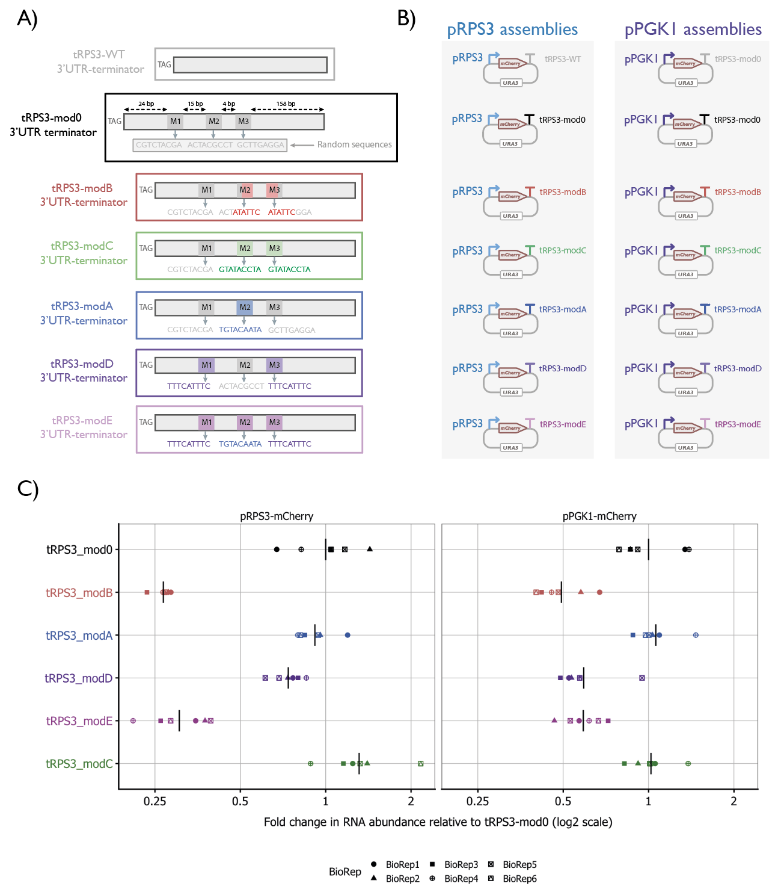
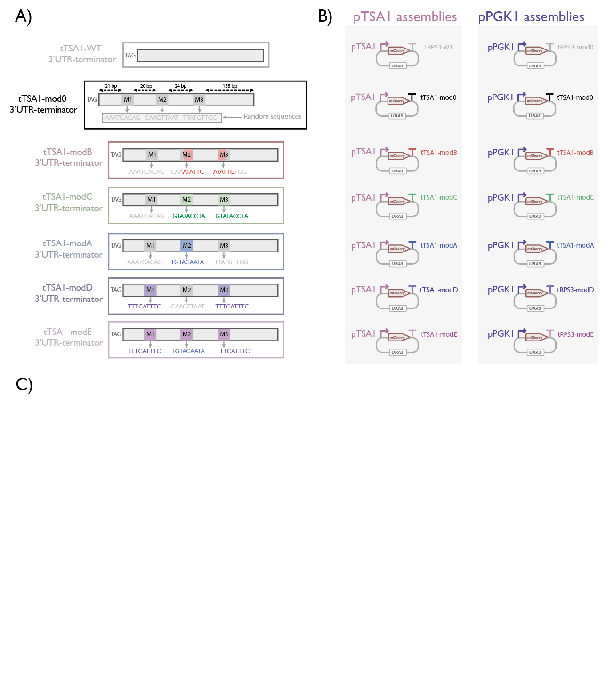
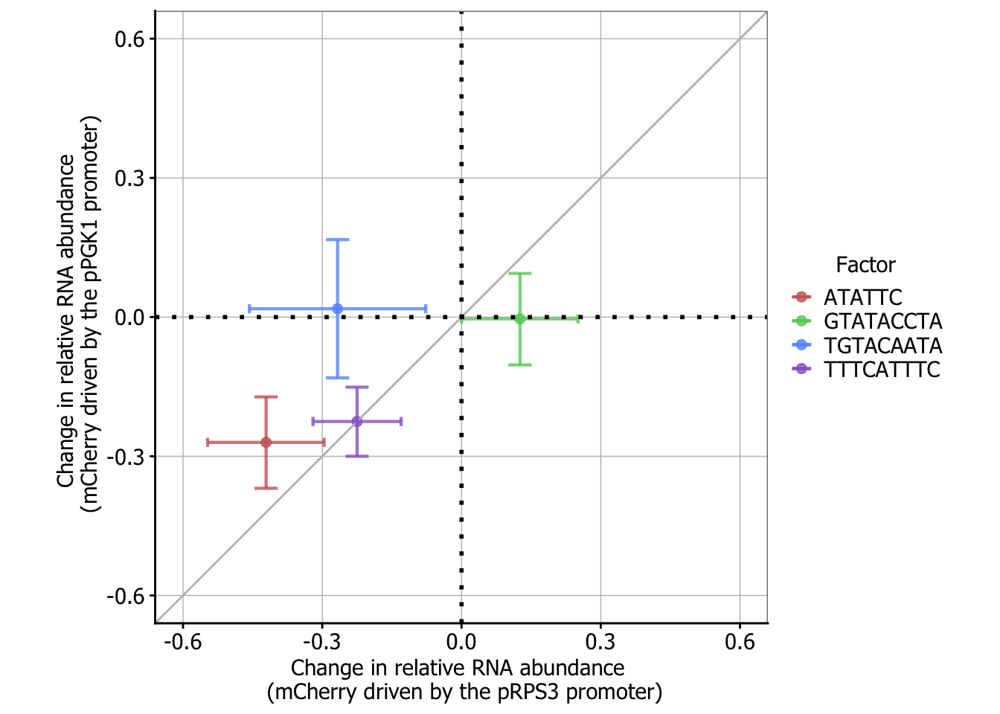

```{r setup, include=FALSE}
knitr::opts_chunk$set(echo = TRUE)
```

### Effects of promoter-terminator swaps on RNA abundance

- pRPS3 with 12x terminator swaps
- pPGK1 withh 12x terminator swaps

### Predicting mRNA abundance with linear combinations of sequences features.

 To study post-transcriptional, cis-regulatory determinants of gene expression, we first determined the contributions to transcript half-lives of 69 suspected 3'UTR binding motifs of RNA decay proteins. We used two independent genome-wide studies of mRNA decay rates, described in Material and Methods, to determine motif contributions with a loose correlation between measured half lives seen in Figure 1. We fitted a linear model of half life to each data set independently, using codon usage and 3'UTR motif frequency as predicates. The predictive power of the models can be seen in Figure 2; ??% and 51% of the variability in half lives was explained for the Sun et al (2013) and Chan et al (2017) data sets respectively. Motifs predicted to be significant in both decay data sets are plotted in Figure 3 with their magnitudes calculated according to the data sets plotted against each other. All four motifs determined to be significant by Cheng et al (2017) appear as significant in both data sets. Interestingly, the TGTAAATA motif was predicted to have opposing effects in the two data sets. 
 
Our analysis was performed separately on two independent, genome-wide studies of yeast mRNA decay rates to confirm motif significance, Sun et al (2013) and Chan et al (2017). Both papers used a non-invasive 4-thio-uracil (4TU) pulse labelling assay to measure decay with minimal metabolic burden.  Sun et al (2013) contained decay rates, which we converted to half lives, for ??% of all annotated transcripts by measuring 4TU incorporation after 6 minutes. We considered the Chan et al (2017) data set more comprehensive and sensitive as it contains half lives for ??% of all annotated transcripts and measured 4TU levels every five minutes for an hour.

We collated 69 3'UTR motifs previously suspected to recruit or obstruct mRNA decay proteins from three separate studies: Hogan et al (2008), Shalgi et al (2005) and Cheng et al (2017). The 14 motifs taken from Hogan et al (2008) where deduced by immunoprecipitating known RNA-binding protiens (RBP) that had been modified by a tandom affinity purification (TAP)-tag which allowed any protein-bound RNA to precipitate alongside. Enrichment analysis highlighted mRNA bound to the proteins beyond random interactions and the 3'UTRs of enriched mRNAs were broken into 6 nucleotide long fragments for consensus sequence analysis. Any 3'UTR consensus sequences associated with decay proteins were chosen as motifs for our analysis. Shalgi et al (2005) provided the most motifs, 51, through enrichment analysis of 3'UTR k-mers with lengths 8-12 in mRNAs within the top and bottom 20-30% of half lives taken from Wang et al (2002). The final 4 motifs from Cheng et al (2017) were found by spliting the 3'UTRs of all mRNAs into k-mers of lengths 3 to 8 and predicting half-life with them using a sparce regression model described in Zhou et al (2013).

  To calculate the frequency of each of the 69 motifs per gene we used the median 3'UTR lengths according to the Pelechano et al (2013) 3'UTR data set. They implement a novel RNA-seq assay, Transcript Isoform (TIF)-seq, to capture the 3' and 5' ends of transcripts and detect common isoforms of transcripts with differing UTRs. Using this data set we removed any motifs with less that six matches and avoided double counting by filtering out occurances of smaller motifs inside longer motifs. Only 38 of the original 69 motifs passed the count filter with the majority of excluded motifs being found downstream of the median polyadenlyation site suggested by Pelechano et al (2013). 
  
  We predicted $log_2$ $\lambda^{1/2}$ for every detected gene using a linear combination of motif frequencies with a greedy algorithm maximising the Akaike information criterion (AIC) to select for motifs with the largest contributions. In addition to motif frequencies, the linear model also included contributions from codon usage as similar work conducted by Cheng et al (2017) showed over 50% of the variabililty in transcript half lives could be explained by codon usage alone. Cheng et al dataset has the half lives for 824 genes not in the Sun et al data set. and is missing 741 and inferred their impacts on mRNA abundance by using a known solution  to a simple model of mRNA production mRNA transcript 3'UTR sequence effects on gene expression  

 The predictive power of the model using the two decay data sets can be seen in Figure 2. The model predicts ??% of the variability in half life with ??% coming from codon usage and ?% from 3'UTR motifs. Comparing results with Cheng et al (2017) motifs shows that we explain less of the variability with the new dataset but still detect the four motifs they determinate as significant. Interestingly, the TGTAAATA motifs was consider stabilitising using the Cheng et al (2017) dataset. The puf3 protein associated with motif is known to change function in carbon deficient condition which were likely present due to the bespoke CSM-lowURA media the cultures were grown in overnight, Sun et al (2013) used standard YPD media. 

### Functional validation of cis-regulatory motifs

Candidate cis-regulatory motifs on the 3'UTR (UGUAHMNUA, HWNCAUUWY, ATATTC, GTATACCTA) previously predicted with large contribution on RNA half life from the linear model trained on the Chan et al. (2017) half life dataset were tested for modulariity and combined linearly to determiine their effects on RNA abundance.These sequence motifs were introduced to two 3'UTRs (tRPS3 and tTSA1) devoid of the candidate consensus motifs of interest and functionally characterised for their effect on RNA abundance by RT-qPCR. The TGTACAATA and TTTCATTTC sequences that satisfy the UGUAHMNUA and HWNCAUUWY consensus motifs respectively were chosen and used for subsequent experimental validation. **[Check why specifically these sequencces were chosen - out of all combinations of the consensus motifs]**

### Effects of candidate cis-regulatory motifs in tRPS3 3'UTR-terminator in combination with different promoters

tRPS3 3'UTR-terminator were modified to incorporate three 9 bp cloning sites for motifs (M1, M2 and M3). The M1 was designed 24 bp downstream of the stop codon. Between M1 and M2 is a 15 bp spacer. M3 is located 4 bp downstream of M2 (Figure 2A). **[Check rationale for spacing]** A control tRPS3 3'UTR (mod0) was designed to incorporate scrambled/random bases in each cloning site, each with a GC content of 56% (Figure 1A). Two copies of the candidate decay motif ATATTC were incorporated to tRPS3-modB at sites M2 and M3. Similarly, Two copies of the candidate stability motif (GTATACCTA) were introduced in tRPS3-modC 3'UTR. One copy of the putative decay motif (UGUAHMNUA) was introduced to tRPS3-modA at site M2 while two copies of another putative decay motif HWNCAUUWY motif were introduced to tRPS3-modD at sites M1 and M3. In order to test the effect of linear combinations of putative decay motifs  on mRNA abundance, the final design incorporated a combination of UGUAHMNUA at site M2 and HWNCAUUWY at sites M1 and M3. These 3'UTR/terminators were asssembled with either pRPS3 or pPGK1 promoters driving the expression of an mCherry reporter gene in a plasmid and expressed in yeast.

**[To add - modB ATATTC design mimicked Cheng et al design]**

Analysis of RNA abundance by RT-qPCR was carried out on these strains showed a decrease in RNA abundance with the incorporation of putative decay motifs (ATATTC, TGTACAATA and TTTCATTTC). However the relative fold change associated with each motif varies depending on promoter choiice. A ~4 fold decrease in RNA abundance with the incorporation of ATATTC when the tRPS3 3'UTR-terminator is coupled with the pRPS3 promoter. However, coupled with the pPGK1 promoter, only a ~2 fold decrease in RNA abundance with the incorporation of ATATTC when the tRPS3 3'UTR-terminator. With the incorporation of both candidate decay motifs - TGTACAATA and TTTCATTTC, a ~4 fold decrease in RNA abundance was observed when the tRPS3 3'UTR-terminator is coupled with the pRPS3 promoter however, only a ~2 fold decrease in RNA abundance was observed when coupled with the pPGK1 promoter. Our results demonstrate that, consistent with our model, the incorporation of candidate decay motifs result in a decrease in protein abundance.

{ width=85% }

### Effects of candidate cis-regulatory motifs in tTSA1 3'UTR-terminator in combination with different promoters

tTSA1 3'UTR-terminator were modified to also incorporate three 9 bp cloning sites for motifs (M1, M2 and M3). The M1 was designed 21 bp downstream of the stop codon. M2 is designed 20 bp downstream of M1 and M3 is designed 24 bp downstream of M2. **[Check rationale for spacing]** The tTSA1 mod0 control scrambled sequences inserted into the M1, M2 and M3 sites contained scrambled/random bases with GC contents of 33%, 22% and 33% respectively (Figure 2A). Similar to tRPS3 constructs, two copies of the candidate decay motif ATATTC were incorporated to tTSA1-modB at sites M2 and M3. Similarly, Two copies of the candidate stability motif (GTATACCTA) were introduced in tTSA1-modC 3'UTR. One copy of the putative decay motif (UGUAHMNUA) was introduced to tTSA1-modA at site M2 while two copies of another putative decay motif HWNCAUUWY motif were introduced to tRPS3-modD at sites M1 and M3. In order to test the effect of linear combinations of putative decay motifs  on mRNA abundance, the final design incorporated a combination of UGUAHMNUA at site M2 and HWNCAUUWY at sites M1 and M3. These 3'UTR/terminators were asssembled with either pTSA1 or pPGK1 promoters driving the expression of an mCherry reporter gene in a plasmid and expressed in yeast.

- RT-qPCR data for tTSA1 swaps with pTSA1 and pPGK1

{ width=85% }

### Modelling the relationship of cis-regulatory motifs on RNA abundance

We fitted a linear model to each dataset (based on promoter - pRPS3 or pPGK1) to determine the contribution of each motif on RNA abundance. The linear model explains ~70% of the variability in RNA abundance due to cis-regulatory motifs in the 3'UTR. With both promoters, the putative stability (GTATACCTA) sequence show no significant effect on RNA abundance. The ATATTC and TTTACTTTC cis-regulatory sequences contribute to a moderate but significant decrease RNA abundance (p<0.001 wth both promoters). Interestingly, the decay (TGTACAATA) motif shows variable effects when in combination with different promooters (p<0.01 with pRPS3, n.s with pPGK1). The combination of both TGTACAATA and TTTCATTTC is not additive, with no significant downregulation of gene expression when present in combination within a 3'UTR with both promooters.

{ width=80% }

### Comparison of whole-genome ATATTC motif effect vs. reporter-gene ATATTC motif effect
- Comparison of our qPCR data of modB with that of Cheng et al. (2017)

### Effect of motif copy number and position in the 3'UTR on RNA abundance
- increasing number of ATATTC motifs
- increasing number of TTTCATTTC motifs (interesting because this often occurs in 2x)

